# 信息安全导论-第二次作业
# S-AES
## yyds组出品

本组根据"信息安全导论"课程第8-9次课讲述的AES算法，在课外认真阅读教科书附录D的内容，
使用Python+PyQt实现了加、解密程序与支持用户交互的GUI界面，
完成了第1-5关的任务要求。

## 项目介绍
本项目的GUI设计了5个界面，分别为主页、加密页、解密页、多重加密页、工作模式页，展示如下：

主页

加密

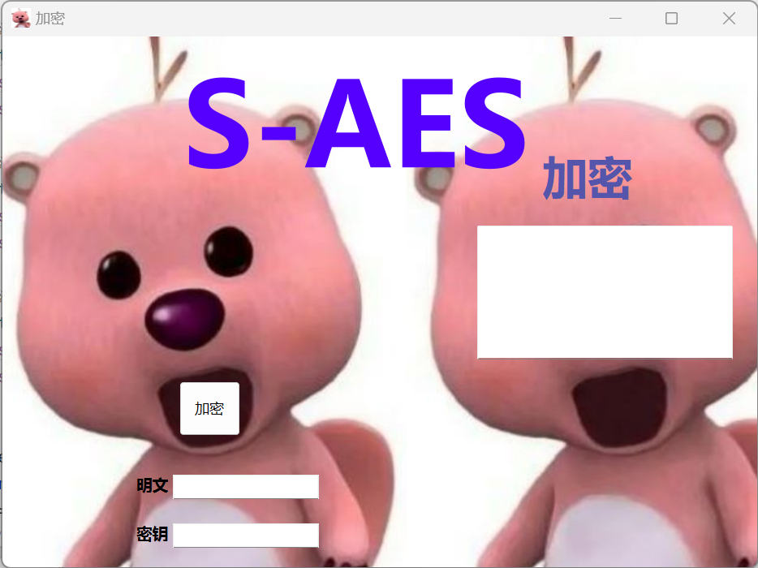

解密

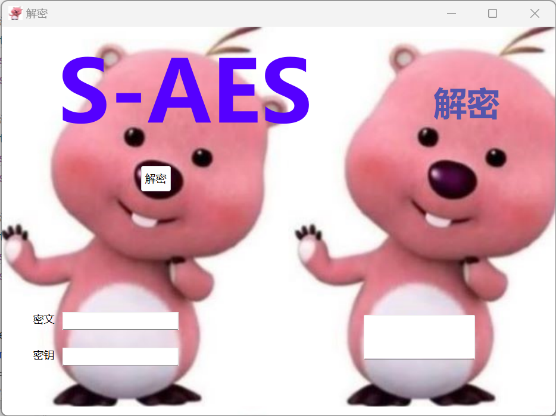

多重加密

工作模式

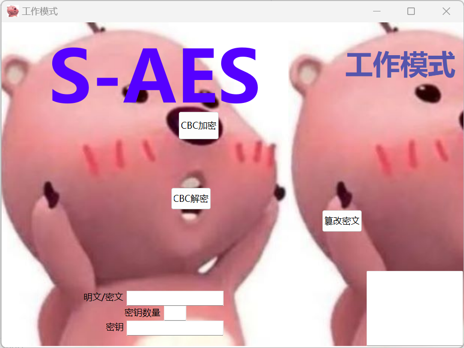

## 通关情况（测试结果）
### 第1关：基本测试

加密
输入明文为：1111000010100101
输入密钥为：1010010101011010
加密结果：0010100001001010

解密
输入密文为：0010100001001010
输入密钥为：1010010101011010
解密结果：1111000010100101
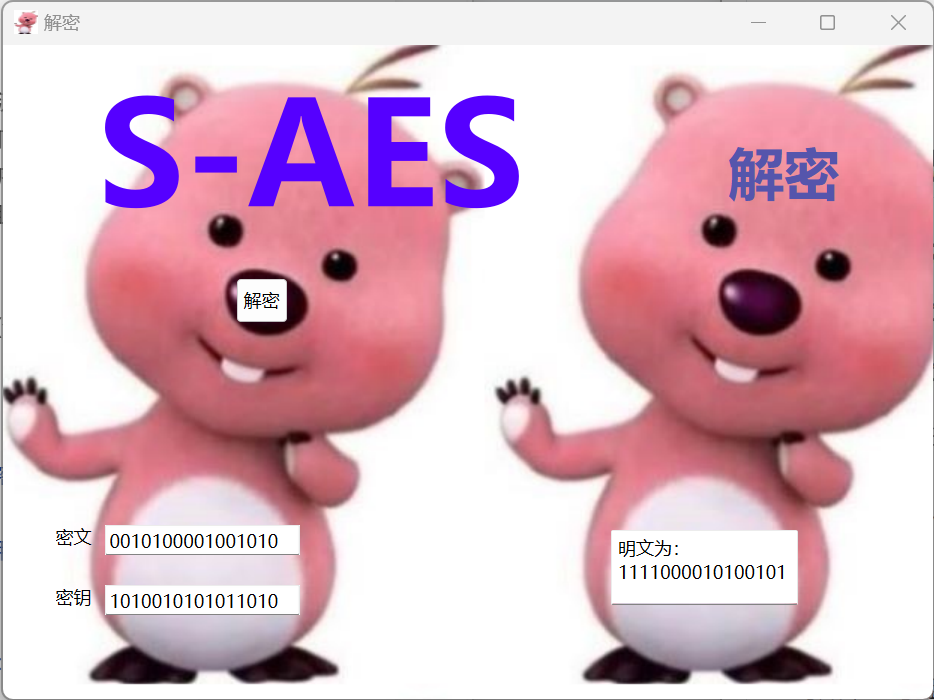

可知16bits数据加解密功能正常，通过基本测试
### 第2关：交叉测试
共用明文为：1100110011001100
共用密钥为：1010101010101010
本组加密结果：0100001110000001
其他组加密结果：0100001110000001

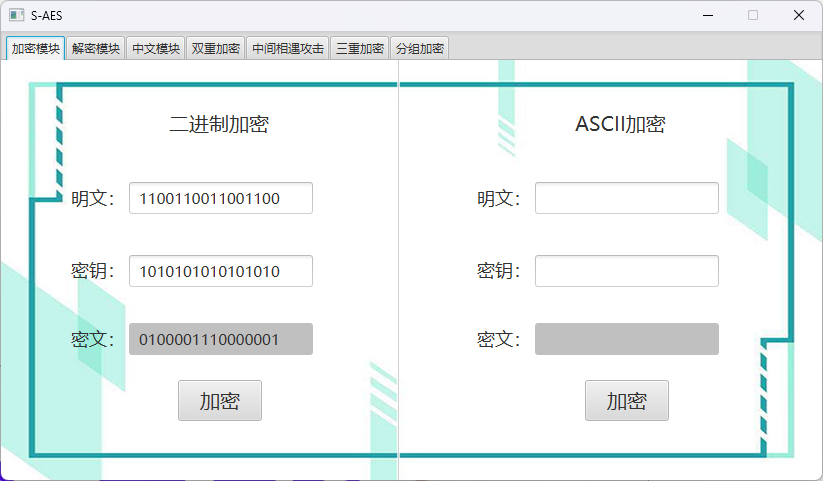

共用密文为：0100001110000001
共用密钥为：1010101010101010
本组解密结果：1100110011001100
其他组解密结果：1100110011001100

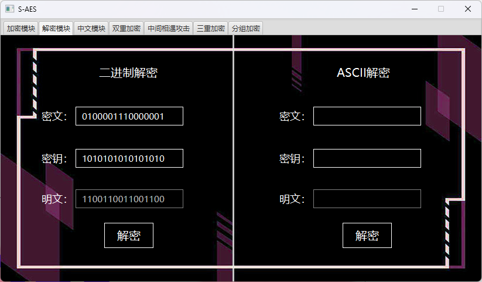

可知本组与其他组加解密结果一致，通过交叉测试
### 第3关：扩展功能

输入ASCII明文为：hello
输入密钥为：1010010101011010
加密结果：：⃰ôンン惾

输入ASCII密文为:：⃰ôンン惾
输入密钥为：1010010101011010
解密结果：hello

可知对ASCII字符串加解密成功，通过扩展功能

### 第4关：多重加密

4.1 双重加密

加密
输入明文为：1111000010100101
输入密钥为：1010010101011010
加密结果：0010100001001010

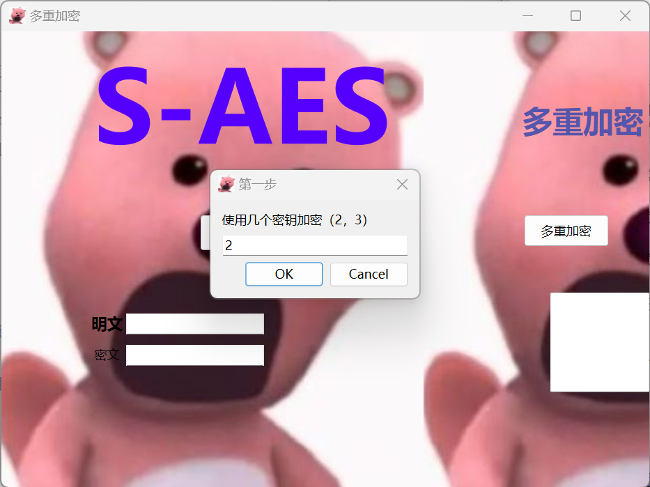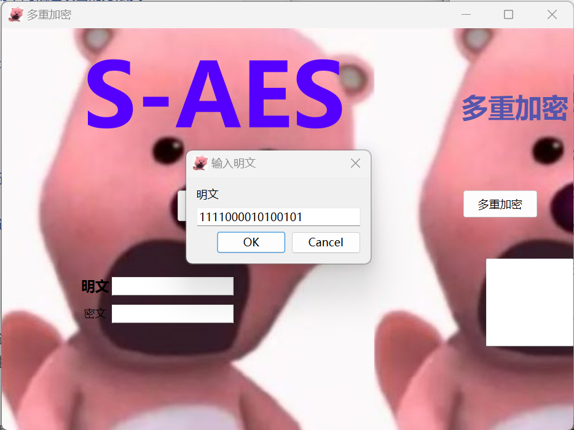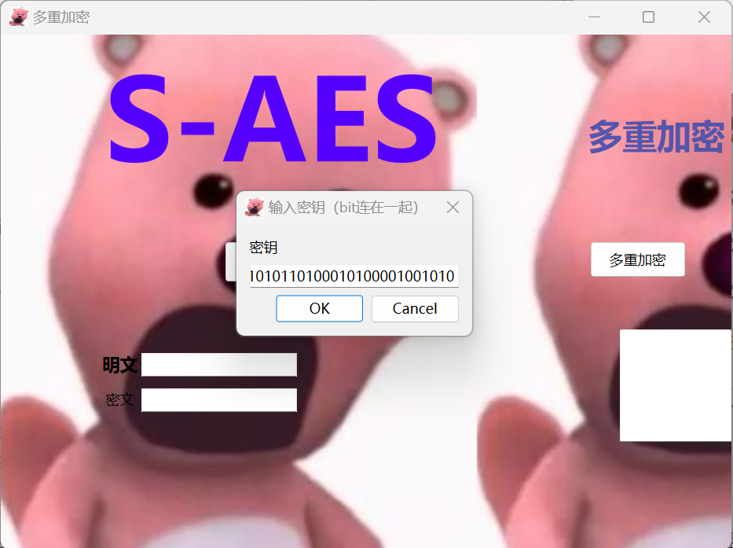

解密部分同加密

ASCII字符串同16bits二进制字符串

4.2 中间相遇攻击
输入明文为：hello
输入密文为：涶嶵趵趵嶸
攻击结果为：10101010101010100000000000000000

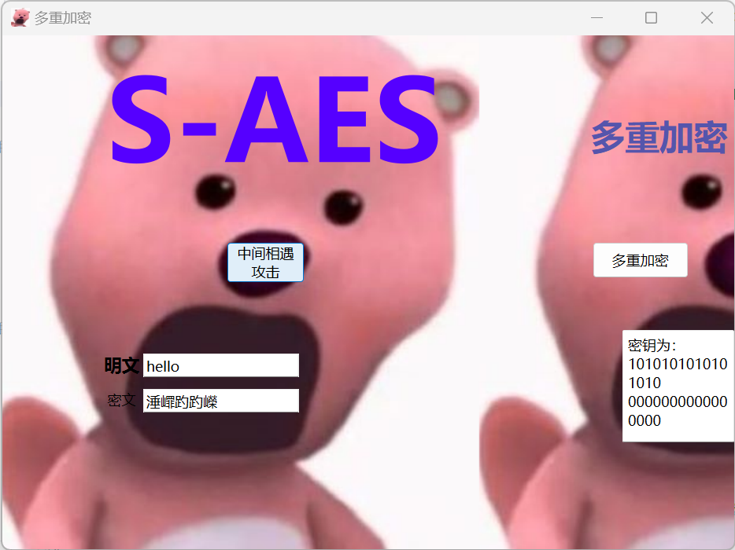

4.3 三重加密
使用48bits（K1+K2+K3）模式进行三重加解密

加密
输入明文为：1111000010100101
输入密钥为：101001010101101000101000010010101111000010100101
加密结果：0010000011100010

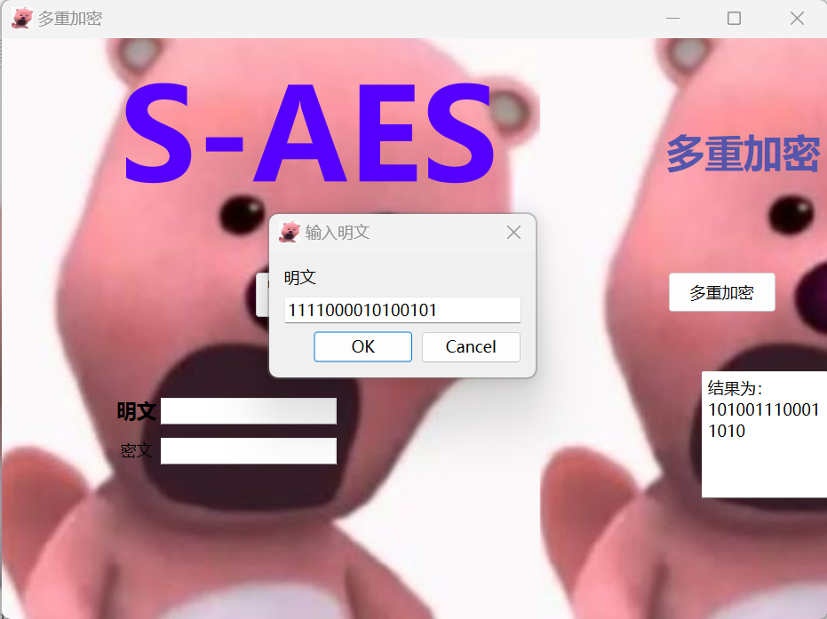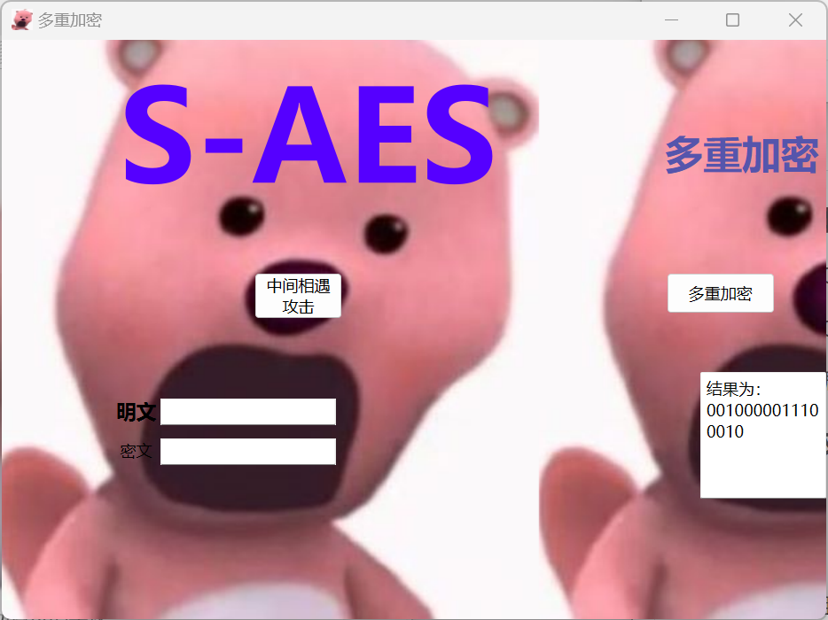

解密部分同加密
ASCII字符串同16bits二进制字符串

可知，实现了双重加解密、三重加解密和使用中间相遇攻击的方法找到正确的密钥，通过多重加密
### 第5关：工作模式

在CBC模式下进行加密

输入明文为：000000000000000011111111111111111010101010101010
输入密钥为：1010101010101010
加密结果：0111110110011000001010111101001000010001010110100000010100001110

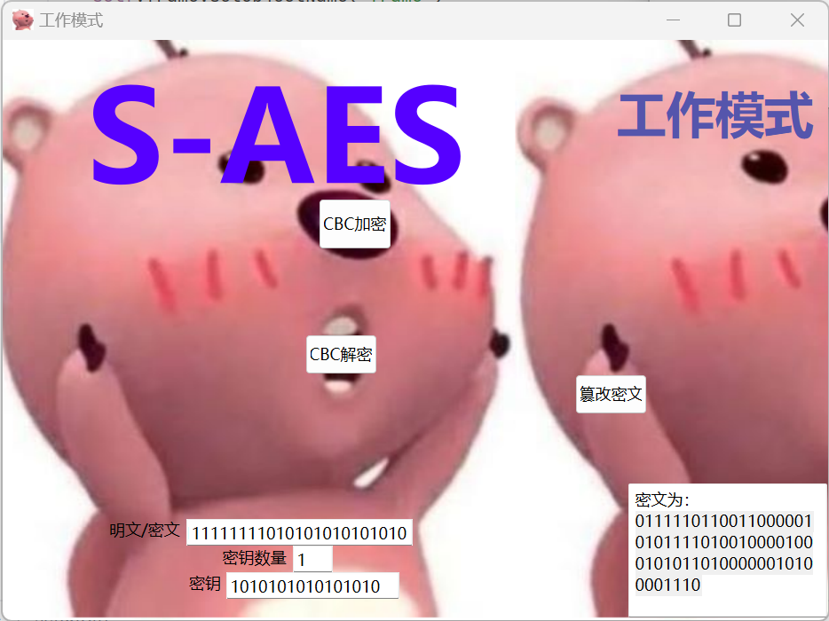

在CBC模式下进行解密

输入明文为：0111110110011000001010111101001000010001010110100000010100001110
输入密钥为：1010101010101010
加密结果：000000000000000011111111111111111010101010101010

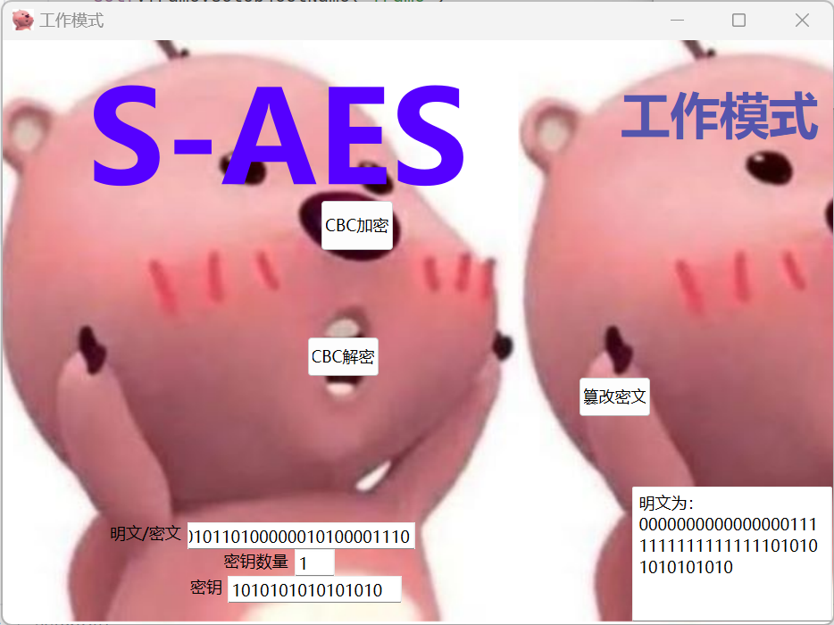

篡改密文后解密

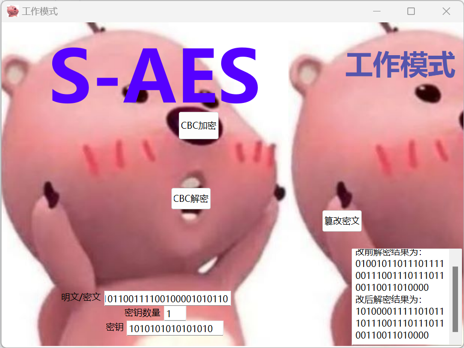

多重加密同上
ASCII字符串同二进制字符串，不再赘述

可知，实现了使用密码分组链(CBC)模式对较长的明文消息进行加密，并对密文分组进行替换或修改，然后进行解密，通过工作模式
