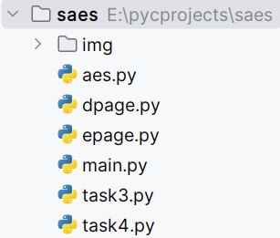

# 开发手册
## yyds组出品

### 1.引言
本开发手册旨在介绍本S-AES程序的开发流程，供参考、学习、交流。
### 2.开发环境
操作系统：推荐使用最新的 Windows 11。
开发工具：推荐使用 Visual Studio Code 或者 JetBrains 的 PyCharm 2023.1。
编程语言：Python + PyQt6。
### 3.项目结构
如下图所示：

### 4.技术栈
前端开发：PyQt6
后端开发：Python
### 5.功能需求
#### 5.1 基本测试
提供GUI解密支持用户交互。输入可以是16bit的数据和16bit的密钥，输出是16bit的密文。
#### 5.2 交叉测试
设有A和B两组位同学(选择相同的密钥K)；则A、B组同学编写的程序对明文P进行加密得到相同的密文C；
或者B组同学接收到A组程序加密的密文C，使用B组程序进行解密可得到与A相同的P。
#### 5.3 扩展功能
加密算法的数据输入可以是ASII编码字符串(分组为2 Bytes)，对应地输出也可以是ACII字符串(很可能是乱码)。
#### 5.4 多重加密
##### 5.4.1 双重加密
将S-AES算法通过双重加密进行扩展，分组长度仍然是16 bits，但密钥长度为32 bits。
##### 5.4.2 中间相遇攻击
找到了使用相同密钥的明、密文对(一个或多个)的情况下，使用中间相遇攻击的方法找到正确的密钥Key(K1+K2)。
##### 5.4.3 三重加密
将S-AES算法通过三重加密进行扩展
### 6.测试
通过1-5关功能测试，具体见Readme.md，不再赘述
### 7.项目维护
本项目将进行定期维护和更新，修复错误和安全漏洞。如发现任何问题，欢迎留言联系。
### 8.参考资料
《密码编码学于网络安全—原理与实践(第8版)》 附录D：简化AES 
《作业2：S-AES算法实现》等等，一并致谢
